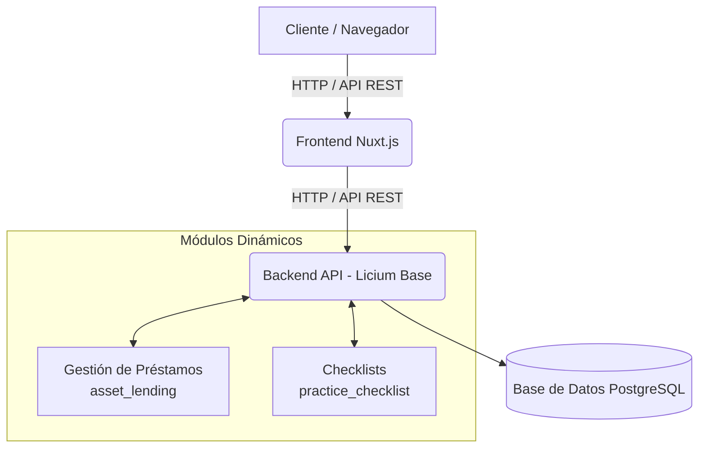

# 📦 Proyecto Licium: Módulos Personalizados

Este proyecto contiene un conjunto de módulos desarrollados para el framework **Licium**. Actualmente cuenta con dos módulos principales diseñados para extender las capacidades del sistema base: **Gestión de Préstamos (`asset_lending`)** y **Checklists Prácticos (`practice_checklist`)**.

---

## 🏗 Arquitectura General del Proyecto

El proyecto está diseñado bajo una arquitectura modular en donde el **Backend** expone una API REST (FastAPI) y se conecta a una base de datos **PostgreSQL**, mientras que el **Frontend** (Nuxt.js) consume los puntos de entrada. Los módulos extienden el núcleo de la aplicación inyectándose dinámicamente.



---

## 📂 Estructura de Carpetas del Repositorio

La estructura principal del proyecto contiene los archivos de configuración y la carpeta `modules` en la que se encuentran ambos módulos a desplegar:

```text
modulo-checkList/
├── docker-compose.backend-dev.yml  # Configuración de los servicios en Docker
├── filestore/                      # Almacenamiento local de archivos (ej. logs)
└── modules/                        # ➔ Directorio raíz de los módulos
    ├── asset_lending/              # Módulo de Préstamos
    └── practice_checklist/         # Módulo de Checklists
```

---

## 🧩 Detalle de los Módulos

### 1. Módulo: Gestión de Préstamos (`asset_lending`)

Este módulo está encargado de llevar el registro y control de activos (`Assets`), su ubicación en diferentes espacios físicos (`Locations`) y gestionar los préstamos (`Loans`) de los mismos a los distintos usuarios del sistema.

#### 📂 Estructura Interna del Módulo

```text
asset_lending/
├── __init__.py
├── __manifest__.yaml       # Metadatos, versión y dependencias (depende de 'core' y 'ui')
├── models/                 # Modelos de Base de Datos (SQLAlchemy)
│   ├── asset.py            # Modelo principal de Activo
│   ├── loan.py             # Modelo del Préstamo (AssetLoan)
│   └── location.py         # Ubicación física del activo
├── security/               # Reglas y políticas de seguridad
│   └── access_control.yml
├── services/               # Lógica de Negocio
│   └── asset_service.py
└── views/                  # Vistas e interfaz del usuario base modelo
    ├── menu.yml            # Entradas de menú del módulo
    └── views.yml           # Declaración y estructura de la interfaz
```

---

### 2. Módulo: Checklists de Práctica (`practice_checklist`)

Este módulo permite crear y gestionar **Checklists** estructurados. Un checklist agrupa múltiples **Tareas (Items)** comprobables (apto para QA, auditorías o procesos estructurados). Además, posee configuraciones particulares como la posibilidad de auto-cerrarse tras una cantidad determinada de días.

#### 📂 Estructura Interna del Módulo

```text
practice_checklist/
├── __init__.py
├── __manifest__.yaml       # Metadatos del módulo (depende de 'ui')
├── data/                   # Datos iniciales y de configuración para el sistema
│   ├── acl_rules.yml       # Reglas de las Listas de Control de Acceso
│   ├── groups.yml          # Grupos de usuarios
│   └── ui_modules.yml      # Declaración frontend
├── i18n/                   # Internacionalización (Idiomas)
│   ├── en.yml              # Textos en Inglés
│   └── es.yml              # Textos en Español
├── models/                 # Modelos de Base de Datos
│   └── checklist.py        # Modelos: PracticeChecklist, PracticeChecklistItem, Setting
├── services/               # Lógica de Negocio
│   └── checklist.py        # Servicios ORM / Controlador
└── views/                  # Vistas de la interfaz del usuario
    ├── menu.yml
    └── views.yml
```

---

## 🚀 Guía de Despliegue en Desarrollo (Docker Compose)

El proyecto incluye un entorno pre-configurado usando **Docker Compose** en el archivo `docker-compose.backend-dev.yml`. Este entorno levanta toda la infraestructura necesaria para desarrollar y correr el sistema.

### Requisitos Previos
*Tener instalado **Docker** y **Docker Compose**.*

### Puesta en Marcha

1. **Inicie los servicios** corriendo el siguiente comando desde el directorio `modulo-checkList`:
   ```bash
   docker-compose -f docker-compose.backend-dev.yml up -d
   ```
2. **Servicios que se levantarán**:
   * `postgres` (Base de datos): Puerto `5432`.
   * `backend` (FastAPI / Licium Base): Puerto `8000`. Expondrá el API y cargará los módulos definidos dinámicamente a través del montaje de volúmenes en `/opt/licium/modules`.
   * `frontend` (Nuxt.js UI): Puerto `3000`. Interfaz moderna conectada al backend.
3. Los módulos se cargan en caliente gracias al motor Uvicorn del backend, monitoreando cambios en el directorio local de los módulos.
